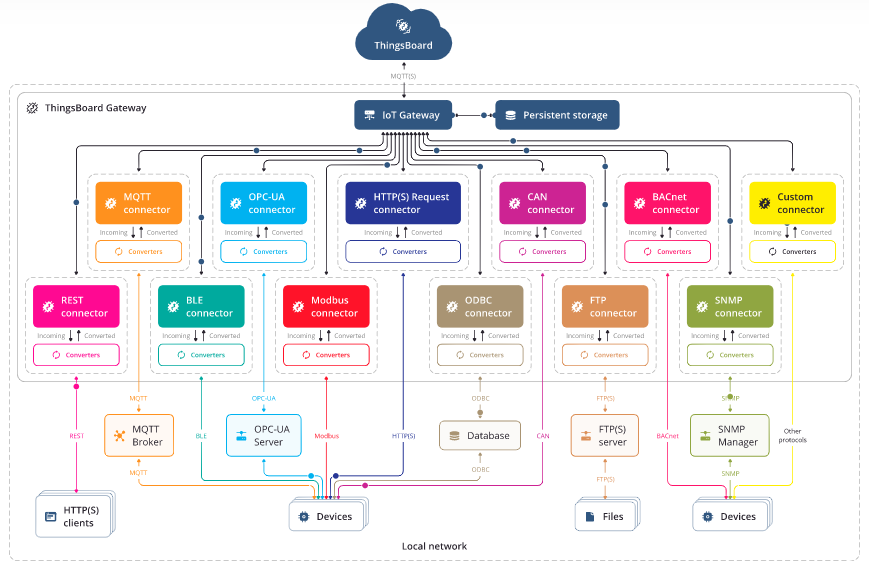
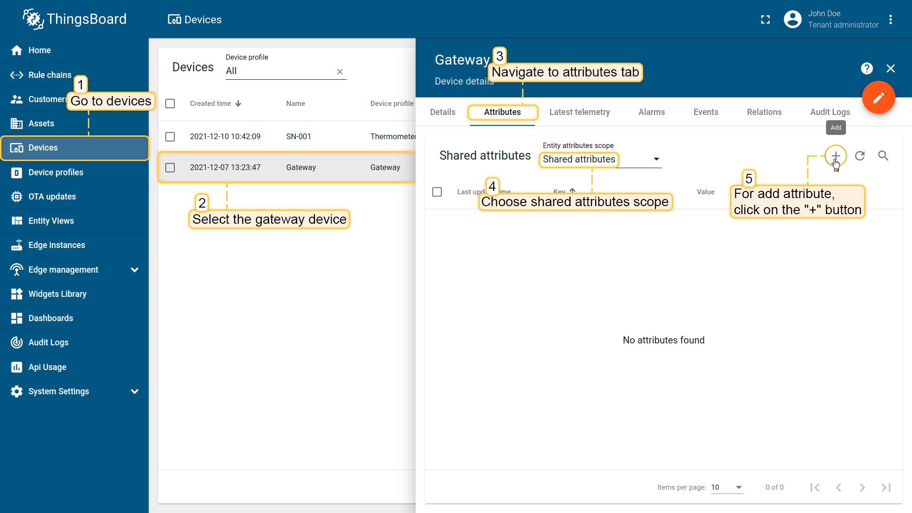
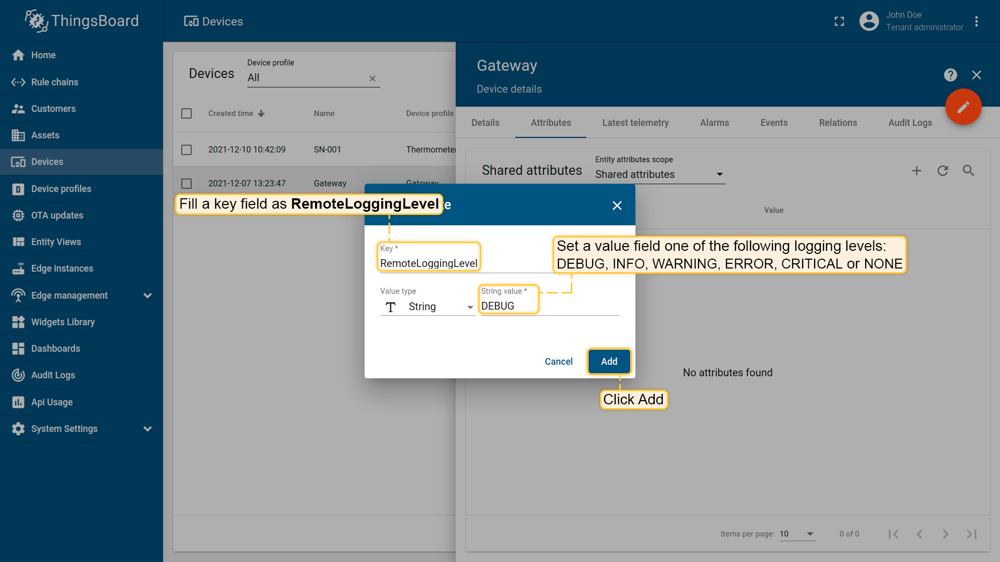
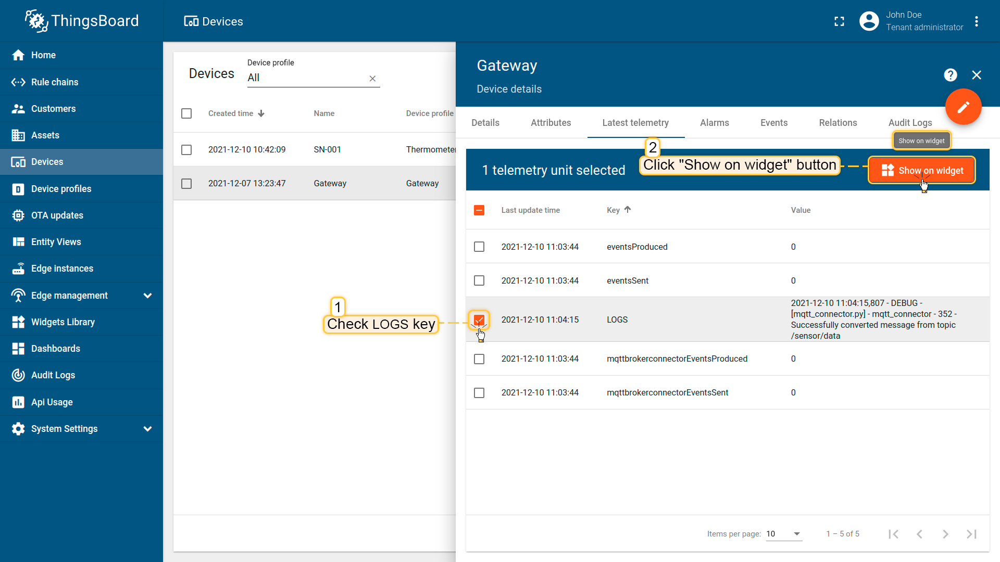
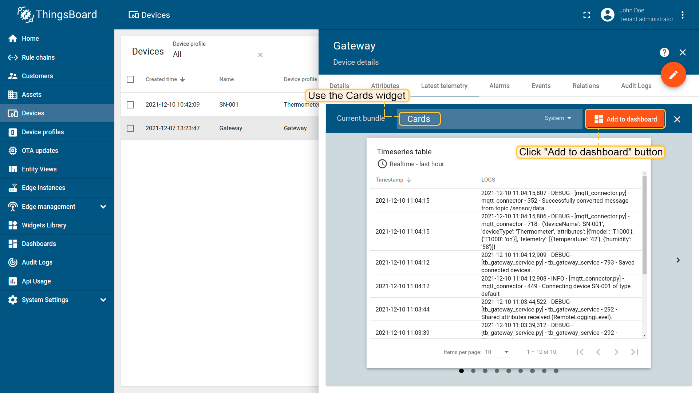
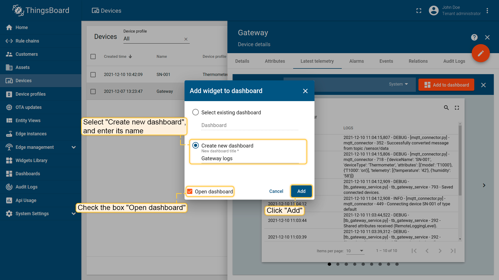
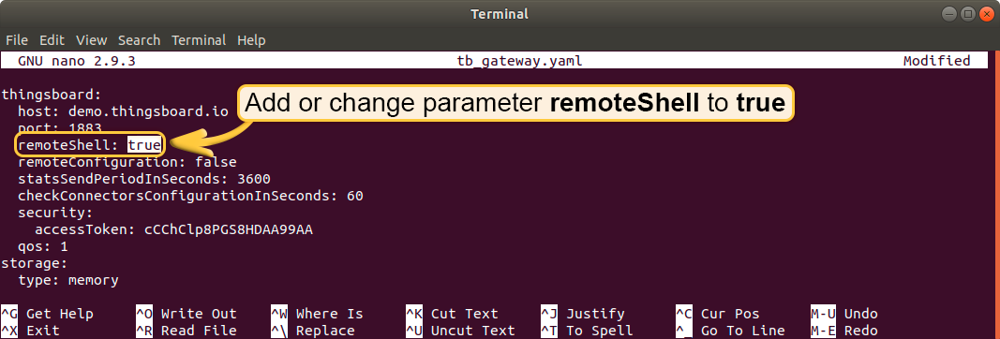
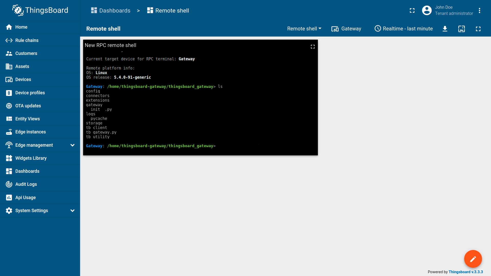

## ThingsBoard 网关

为了将您的物联网网关连接到 ThingsBoard 服务器，您需要首先提供网关凭据。我们将使用访问令牌凭证作为最简单的凭证。有关详细信息，请参阅设备身份验证选项。

The IoT Gateway 是一个基于 Linux 的支持 **Python 3.7+** 的微机上运行的软件组件。

## 网关架构

对平台来说网关是一个设备：只不过网关的消息体和其他设备不一样，网关监听的是消息代理发送的消息。针对 MQTT 来说，网关只不过选择性监听了 topic，构建了一个映射 “map” 关系。



## 网关安装

### 方案一：Ubuntu 系统通过源代码方式安装

从源代码安装 ThingsBoard 网关您应遵循以下步骤：

**1\. 使用 apt 将所需的库安装到系统中：**
`sudo apt install python3-dev python3-pip libglib2.0-dev git`

**2\. 克隆指定版本的网关源代码：**

```sh
git clone -b 3.0.1 --depth 1 git@github.com:thingsboard/thingsboard-gateway.git
```

或者

```sh
curl -LJO https://github.com/thingsboard/thingsboard-gateway/archive/refs/tags/3.0.1.tar.gz
```

**3\. 进入 thingsboard-gateway 目录：**

```sh
cd thingsboard-gateway
```

**4\. 在项目根目录，使用 setup.py 脚本安装 python 模块：**

```sh
python3 setup.py install
```

**5\. 创建“日志”文件夹：**

```sh
mkdir logs
```

**6\. 将网关配置为与您的 ThingsBoard 平台实例一起使用**
选择并配置 connector 连接器。

**7\. 运行网关，检查安装结果：**

```sh
python3 ./thingsboard_gateway/tb_gateway.py
```

**期间遇到问题**
运行报错 AttributeError: module 'google.protobuf.descriptor' has no attribute '_internal_create_key'

解决方案：try the next command `pip install --upgrade protobuf`

### 通过 docker 安装网关

linux or mac use:

```sh
docker run -it \
-v ~/.tb_gateway/logs:/thingsboard_gateway/logs \
-v ~/.tb_gateway/extensions:/thingsboard_gateway/extensions \
-v ~/.tb_gateway/config:/thingsboard_gateway/config \
--name tb-gateway \
--restart always \
thingsboard/tb-gateway
```

windows use:

```bat
docker run -it ^
-v %HOMEPATH%/tb_gateway/config:/thingsboard_gateway/config ^
-v %HOMEPATH%/tb_gateway/extensions:/thingsboard_gateway/extensions ^
-v %HOMEPATH%/tb_gateway/logs:/thingsboard_gateway/logs --name tb-gateway ^
--restart always ^
thingsboard/tb-gateway
```

目录说明：

* 配置文件 config
* 日志文件 logs
* 拓展支持文件 extensions。

## 配置指南

### 目录结构

请在下面查看默认目录结构。

```text
/etc/thingsboard-gateway/config  - Configuration folder.
    tb_gateway.yaml              - Main configuration file for Gateway.
    logs.conf                    - Configuration file for logging.
    modbus.json                  - Modbus connector configuration.
    mqtt.json                    - MQTT connector configuration.
    ble.json                     - BLE connector configuration.
    opcua.json                   - OPC-UA connector configuration.
    request.json                 - Request connector configuration.
    can.json                     - CAN connector configuration. 
    ... 

/var/lib/thingsboard_gateway/extensions - Folder for custom connectors/converters.                      
    modbus                              - Folder for Modbus custom connectors/converters.
    mqtt                                - Folder for MQTT custom connectors/converters.
        __init__.py                     - Default python package file, needed for correct imports.
        custom_uplink_mqtt_converter.py - Custom Mqtt converter example.
    ...
    opcua        - Folder for OPC-UA custom connectors/converters.
    ble          - Folder for BLE custom connectors/converters.
    request      - Folder for Request custom connectors/converters.
    can          - Folder for CAN custom connectors/converters.

/var/log/thingsboard-gateway    - Logs folder
    connector.log               - Connector logs.
    service.log                 - Main gateway service logs.
    storage.log                 - Storage logs.
    tb_connection.log           - Logs for connection to the ThingsBoard instance.
```

## MQTT Connector

配置文件 config/tb_gateway.yml。

host 是 thingsboard 的 ip 地址，port 是 thingsboard 的 MQTT 的 port 端口。这里由于要映射到 docker 容器中，所以在宿主机中配置 host 为 host.docker.internal，端口为 tb 中正在使用的 1883。
accessToken 是网关的口令，拷贝设备网关的 token 即可。

配置 connectors 只启用 mqtt。

```yml
thingsboard:
  host: host.docker.internal
  port: 1883
  remoteShell: false
  remoteConfiguration: false
  statsSendPeriodInSeconds: 3600
  minPackSendDelayMS: 0
  checkConnectorsConfigurationInSeconds: 60
  security:
    accessToken: Q90dlbds3BOhSnvMI7gq
  qos: 1
storage:
  type: memory
  read_records_count: 100
  max_records_count: 100000
#  type: file
#  data_folder_path: ./data/
#  max_file_count: 10
#  max_read_records_count: 10
#  max_records_per_file: 10000
#  type: sqlite
#  data_file_path: ./data/data.db
#  messages_ttl_check_in_hours: 1
#  messages_ttl_in_days: 7
grpc:
  enabled: false
  serverPort: 9595
  keepaliveTimeMs: 10000
  keepaliveTimeoutMs: 5000
  keepalivePermitWithoutCalls: true
  maxPingsWithoutData: 0
  minTimeBetweenPingsMs: 10000
  minPingIntervalWithoutDataMs: 5000
connectors:
  -
    name: MQTT Broker Connector
    type: mqtt
    configuration: mqtt.json
```

下一步配置 mqtt 远程信息，但是需要安装 mqtt broker。

为了方便测试，这里我使用的是 hivemq。

使用 docker 进行部署 hivemq：

```sh
docker run \
-p 8087:8080 \
-p 1599:1883 \
hivemq/hivemq4
```

hivemq 的 web 控制台，地址为 <http://localhost:8087>。

配置 gateway 中的 mqtt.json

```json
{
  "broker": {
    "name": "Default Local Broker",
    "host": "host.docker.internal",
    "port": 1599,
    "clientId": "ThingsBoard_gateway",
    "maxMessageNumberPerWorker": 10,
    "maxNumberOfWorkers": 100,
    "security": {
      "type": "basic",
      "username": "admin",
      "password": "hivemq"
    }
  },
  "mapping": [
    {
      "topicFilter": "/sensor/data",
      "converter": {
        "type": "json",
        "deviceNameJsonExpression": "${serialNumber}",
        "deviceTypeJsonExpression": "${sensorType}",
        "timeout": 60000,
        "attributes": [
          {
            "type": "string",
            "key": "model",
            "value": "${sensorModel}"
          },
          {
            "type": "string",
            "key": "${sensorModel}",
            "value": "on"
          }
        ],
        "timeseries": [
          {
            "type": "double",
            "key": "temperature",
            "value": "${temp}"
          },
          {
            "type": "double",
            "key": "humidity",
            "value": "${hum}"
          },
          {
            "type": "string",
            "key": "combine",
            "value": "${hum}:${temp}"
          }
        ]
      }
    },
    {
      "topicFilter": "/sensor/+/data",
      "converter": {
        "type": "json",
        "deviceNameTopicExpression": "(?<=sensor\/)(.*?)(?=\/data)",
        "deviceTypeTopicExpression": "Thermometer",
        "timeout": 60000,
        "attributes": [
          {
            "type": "string",
            "key": "model",
            "value": "${sensorModel}"
          }
        ],
        "timeseries": [
          {
            "type": "double",
            "key": "temperature",
            "value": "${temp}"
          },
          {
            "type": "double",
            "key": "humidity",
            "value": "${hum}"
          }
        ]
      }
    },
    {
      "topicFilter": "/custom/sensors/+",
      "converter": {
        "type": "custom",
        "extension": "CustomMqttUplinkConverter",
        "extension-config": {
          "temperatureBytes": 2,
          "humidityBytes": 2,
          "batteryLevelBytes": 1
        }
      }
    }
  ],
  "connectRequests": [
    {
      "topicFilter": "sensor/connect",
      "deviceNameJsonExpression": "${SerialNumber}"
    },
    {
      "topicFilter": "sensor/+/connect",
      "deviceNameTopicExpression": "(?<=sensor\/)(.*?)(?=\/connect)"
    }
  ],
  "disconnectRequests": [
    {
      "topicFilter": "sensor/disconnect",
      "deviceNameJsonExpression": "${SerialNumber}"
    },
    {
      "topicFilter": "sensor/+/disconnect",
      "deviceNameTopicExpression": "(?<=sensor\/)(.*?)(?=\/disconnect)"
    }
  ],
  "attributeRequests": [
    {
      "retain": false,
      "topicFilter": "v1/devices/me/attributes/request",
      "deviceNameTopicExpression": "${SerialNumber}",
      "attributeNameJsonExpression": "${sensorModel}"
    }
  ],
  "attributeUpdates": [
    {
      "retain": true,
      "deviceNameFilter": "SmartMeter.*",
      "attributeFilter": "uploadFrequency",
      "topicExpression": "sensor/${deviceName}/${attributeKey}",
      "valueExpression": "{\"${attributeKey}\":\"${attributeValue}\"}"
    }
  ],
  "serverSideRpc": [
    {
      "deviceNameFilter": ".*",
      "methodFilter": "echo",
      "requestTopicExpression": "sensor/${deviceName}/request/${methodName}/${requestId}",
      "responseTopicExpression": "sensor/${deviceName}/response/${methodName}/${requestId}",
      "responseTimeout": 10000,
      "valueExpression": "${params}"
    },
    {
      "deviceNameFilter": ".*",
      "methodFilter": "no-reply",
      "requestTopicExpression": "sensor/${deviceName}/request/${methodName}/${requestId}",
      "valueExpression": "${params}"
    }
  ]
}
```

这里面最主要的是 broker 这段。host 就是 hivemq 的ip 地址，port 是 hivemq 的 port 端口。security 是默认的安全配置，官网推荐的是 basic。

我们通过 mqtt.js 进行客户端请求发送。

可以看到我们通过网关将我们配置的设备信息已经显示到 thingsboard 中去了。

### 字段说明

deviceNameJsonExpression 设备名称
deviceTypeJsonExpression 设备类型，作为 Device profile

## 模拟实现具体应用场景

## 故障排除

ThingsBoard 日志存储在以下目录中:
**/var/log/thingsboard**

你可以发出以下命令以检查后端是否有任何错误:
`cat /var/log/thingsboard/thingsboard.log | grep ERROR`

## 网关产品特点

### 记录远程日志

#### 激活日志功能和设置日志记录级别



在添加共享属性窗口中，
The name field 必须选择 RemoteLoggingLevel
The value field 用于设置日志打印级别, 可选值如下:

```text
 DEBUG
 INFO
 WARNING
 ERROR
 CRITICAL
 NONE
 ```

 

打开网关设备的 Latest telemetry 标签页，你将看见新添加的 telemetry key – LOGS。

#### 在 dashboard 中显示日志

1\. Check LOGS key and click “Show on widget” button:


2\. We will use the default Cards widget:


3\. Choose Timeseries table Card widget and add it to the Dashboard. It can be either the new one or the existing dashboard.


### 服务端 RPC

创建 dashboard

To use the debug terminal we have to add RPC debug terminal widget from Control widget bundle.
To do this we use following steps:

1. Open Dashboards tab;
2. Add a new dashboard;
3. Open created dashboard, enter edit mode by clicking pencil button in the bottom right corner and click “Add new widget” button;
4. Select widget bundle - “Control widgets”;
5. Scroll down and select RPC debug terminal widget;
6. We haven’t specify the entity type for the widget so we will create a new one;
7. Fill in required fields and same the entity. Gateway - is our gateway device;
8. Apply all changes;
9. The connected widget looks like (Connection setups automatically).
Now you can use Debug Terminal to send RPC requests to the gateway.

**Gateway RPC methods**
To send RPC requests to the gateway the one should use RPC Debug Terminal from Control widgets bundle.
ThingsBoard IoT gateway has several RPC methods, which called from WEB UI, available by default.
The list of OOTB methods will be extended within upcoming releases.

gateway_ping RPC method

gateway_ping RPC method is used to check connection to the gateway and RPC processing status. Every command with prefix “gateway_” will be interpreted as a command to general gateway service and not as an RPC request to the connector or device.
Command:
`gateway_ping`

Gateway RPC ping method
gateway_devices RPC method
gateway_devices RPC method is used to list devices connected through the gateway with info about the type of connector used. This method returns object in “resp” with key-value parameters, where: key — is a device name value — identifies the connector
Command:
`gateway_devices`

Gateway RPC devices method

gateway_restart RPC method
gateway_restart RPC method is used to schedule restart action, e.g. bash gateway_restart 60 set up the restart of the gateway service in 60 seconds. This method uses seconds as measuring unit.
Note: The response will be returned after adding the task to the gateway scheduler.
Command:
`gateway_restart 60`

gateway_reboot RPC method
gateway_reboot RPC method is used to schedule rebooting of the gateway device (hardware?), e. g. bash gateway_reboot 60 set up the reboot of the gateway device in one minute. Take into account: this method available if you start the gateway service as a python module instead of daemon approach and the user that is running the gateway has reboot permissions.
Command:
`gateway_reboot 60`

### 远程 shell

#### 步骤一 激活远程 shell

1\. you should add or change parameter remoteShell to true in the section thingsboard in the general configuration file (tb_gateway.yaml);



> 警告: 此功能可能会导致您的设备的安全问题，我们强烈建议只使用 ssl 加密，如果您不需要，不启用它。

2\. 创建 dashboard

Select widget bundle - “Control widgets”;
Scroll down and select RPC remote shell widget;
Fill in required fields and same the entity. Gateway - is our gateway device;
Now you can use the shell to control device with the gateway. For example we run ls command to get the list of files and directories in the current directory.



### 设备重命名/移除处理

设备重命名方案

网关使用设备实体名称来报告来自连接设备的遥测信息。如果实体名称在 ThingsBoard UI 上更改，则最终用户可能会遇到使用旧名称重新配置设备实体(通过网关)的情况。关于重命名的到网关通知不再是这种情况。

设备删除场景

在 ThingsBoard UI 上删除设备实体会导致数据丢失，因为网关本身不能也不能正确地解决擦除问题。通过向网关发送“已删除”通知，网关代表物理设备启动一个新的连接消息，因此该消息是安全的，不会丢失数据。

网关设备的 RPC 数据示例:

```text
  {
    "method": "gateway_device_renamed",
    "params": {"Old device name": "New device name"}
  }
```

```text
  {
    "method": "gateway_device_deleted",
    "params": "Removed device name"
  }    
```

### 配置 gateway 通过 Configurator

本指南将帮助您使用 Configurator 配置您的 ThingsBoard 物联网网关，特别是如果您使用 deb 包进行安装。

要开始配置网关，你必须启动你的终端和启动配置器使用下面的命令:

```sh
tb-gateway-configurator
```

使用您的选项回答将依次显示的问题(您可以使用输入字段中显示的默认值)。
注意: 默认值取自/etc/thingsboard-gateway/config/tb _ gateway. yaml，所有通过 CLI 进行的配置都将保存在那里。

最后，你可以使用以下命令启动你的 ThingsBoard IoT gateway:

```sh
thingsboard-gateway
```

## 参考文档

<https://thingsboard.io/docs/iot-gateway/what-is-iot-gateway/>
