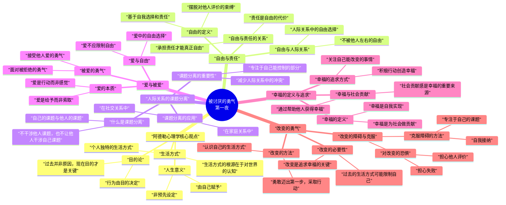

## 手机变附屏

### spacedesk

用于手机或者平板当附屏，稍微有点卡，可能路由器需要上 ac 吧

[spacedesk by datronicsoft](https://www.spacedesk.net/zh/)

[服务端](https://www.spacedesk.net/download/#server-driver) 需要和[客户端](https://www.spacedesk.net/download/#client-driver)配合
[安卓端](https://play.google.com/store/apps/details?id=ph.spacedesk.beta) 或 [apkpure 下载](https://apkpure.com/cn/search?q=SPACEDESK)

软件非常小巧，确实不可多得

### 串流方式

几乎无延迟的无线副屏？sunshine+moonlight最强串流！【保姆级教学】 b站有教程

sunshine [文档](https://docs.lizardbyte.dev/projects/sunshine/en/latest/index.html)

<!-- more -->

[Moonlight Game Streaming](https://moonlight-stream.org/)：远程玩您的 PC 游戏 --- Moonlight Game Streaming: Play Your PC Games Remotely

## 如果已经有第二块实体屏

### 天天工作台

我感觉就那样，不是特别实用

## 远程控制

### 相互操作

[monect 魔控](https://www.monect.com/#download) - 远程控制软件|远程连接软件|远程控制电脑|远程桌面工具
有点臃肿 留着备用

### 手机模拟遥控器玩电脑游戏

Florian Grill - [DroidJoy](https://grill2010.github.io/droidJoy.html) 非常好用

