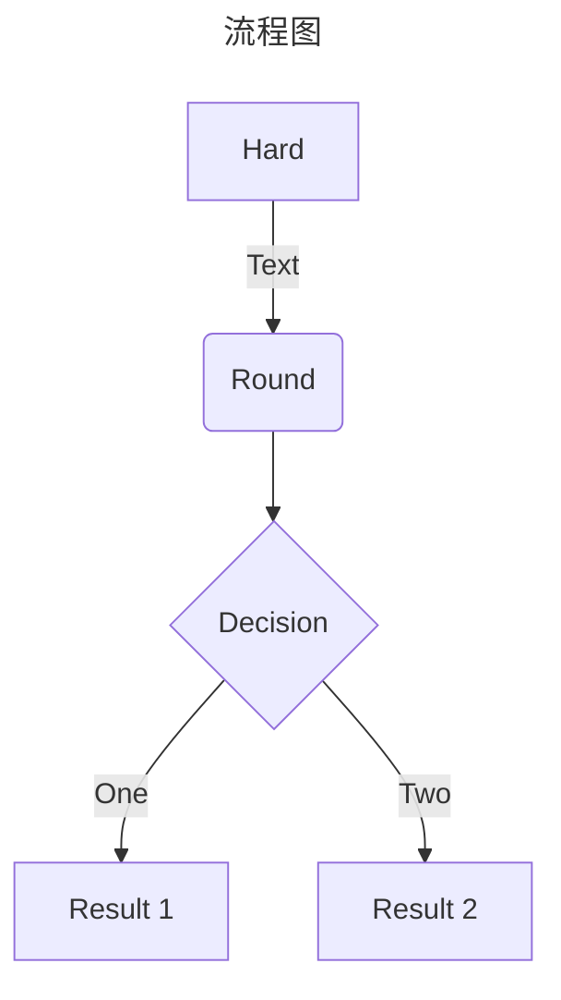
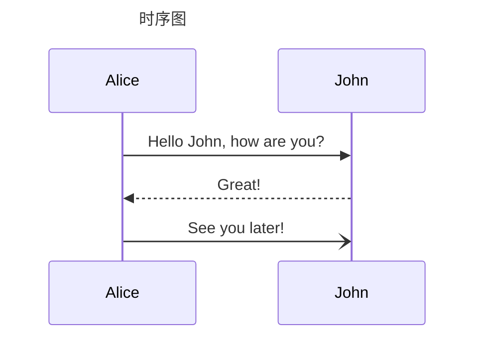
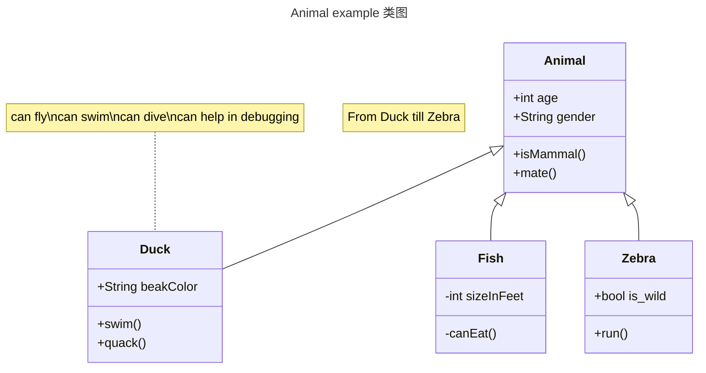
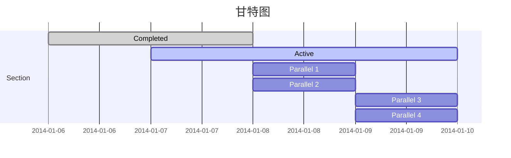
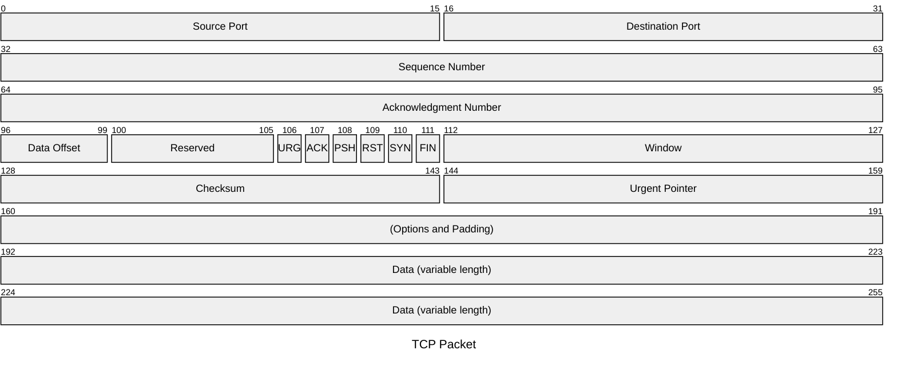
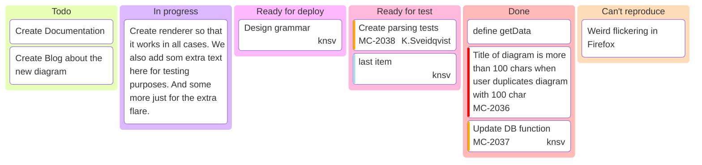
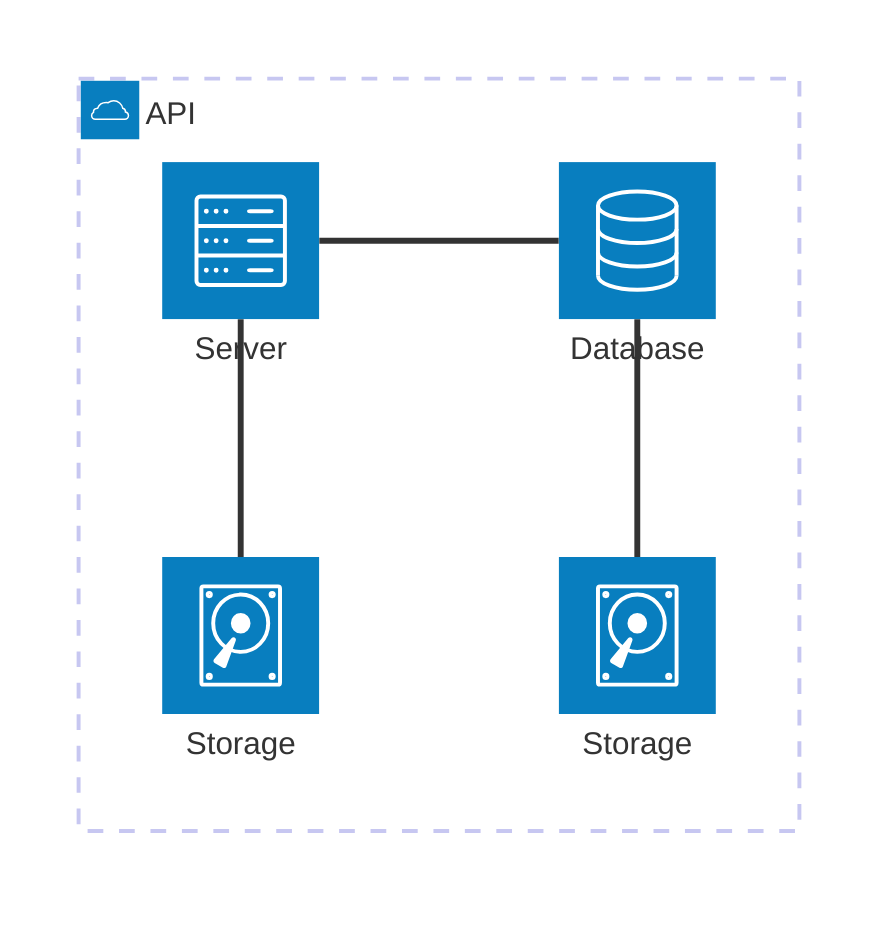
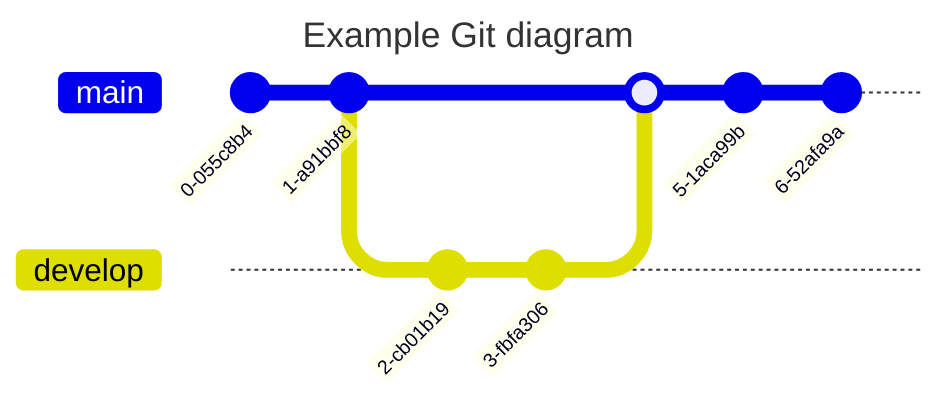
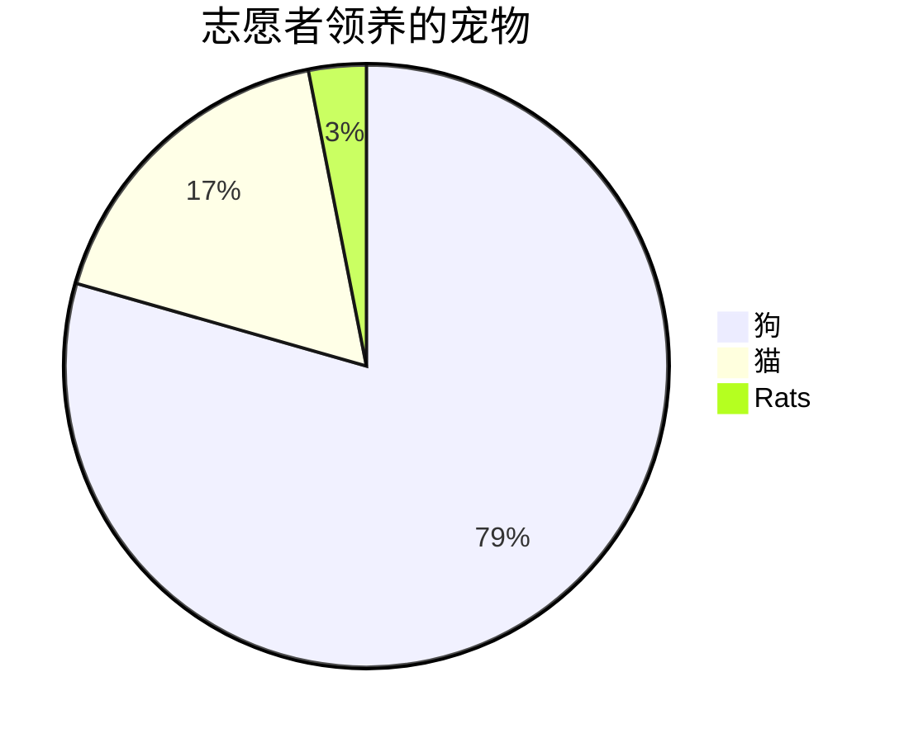
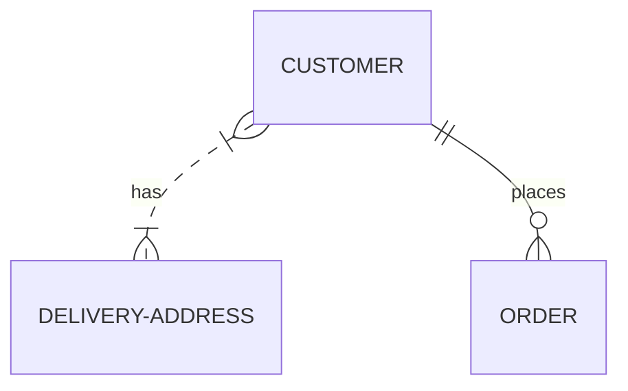

Mermaid 是一个基于 JavaScript 的图表绘制工具，可渲染 Markdown 启发的文本定义以动态创建和修改图表。

## 流程图

流程图由节点（几何形状）和边（箭头或线条）组成。Mermaid 代码定义了如何制作节点和边，并适应不同的箭头类型、多方向箭头以及任何与子图的链接。

<!-- more -->

## 时序图

时序图是一种交互图，显示进程如何彼此运行以及以什么顺序运行。

## 类图

在软件工程中，统一建模语言（UML）中的类图是一种静态结构图，它通过显示系统的类、它们的属性、操作（或方法）以及对象之间的关系来描述系统的结构。

## 甘特图

## 数据包图

## 看板图

## 架构图

## Git 图

## 饼图

## ER（实体关系）图

## 参考

[Mermaid 中文网](https://mermaid.nodejs.cn)