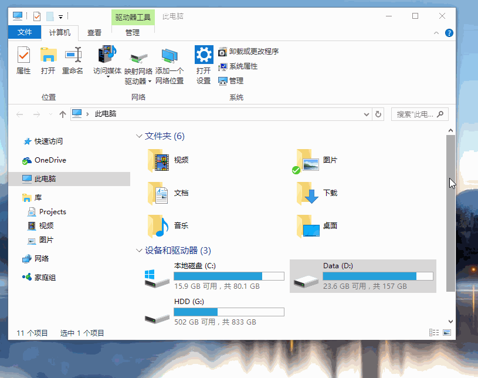
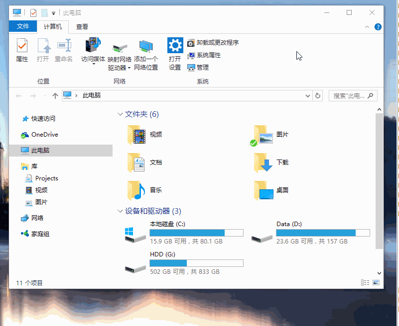

## ShareX(适用于 Win)

Releases · ShareX/ShareX
<https://github.com/ShareX/ShareX/releases>

Image effects - ShareX <https://getsharex.com/image-effects/>
使用方式，直接拖入

## Snipaste(适用于 Win & Mac)

> [Snipaste][1] 是一个简单但强大的截图工具，也可以让你将截图贴回到屏幕上！下载并打开 Snipaste，按下 F1 来开始截图，选择“复制到剪贴板”，再按 F3，截图就在桌面置顶显示了。就这么简单！可贴图、可截屏、可标注。

这样也就不用再担心 QQ/微信 未登录状况下用不了截图软件的问题。

### 截屏

* 截屏（F1）
* 保存到剪贴板（双击截屏区域）
* 保存到文件 (Ctrl+ S)
* 快速保存 (Ctrl + Shift + S)
* 取消当前编辑状态(按下鼠标右键)

### 取色

* 当放大镜可见的时候，按下 C 可复制该像素点的颜色值（RGB/Hex）。之后可以 F3 将它贴出，或者 Ctrl + V 贴到其他程序里
* 可按下 Shift 来切换颜色格式

### 贴图

请正确理解**贴图**：大部分情况下，贴图是将系统剪贴板中的内容转化成图片，然后作为窗口置顶显示。
所以，能否贴出来、贴出来的是什么，取决于系统剪贴板中的内容。

* 贴图(F3)
* 旋转贴图 (1, 2)
* 水平/垂直翻转 (3, 4)
* 缩放贴图(滚动鼠标化滑轮)

### 高级使用技巧

* 快速标注界面元素
  * 截图时选中矩形、椭圆、或者 记号笔/马赛克/高斯模糊/橡皮擦 的矩形填充画笔，按下 鼠标右键 即可自动选中界面元素  (需打开 "自动检测窗口" 选项)
  
* 调节画笔透明度
  * 点击工具条中那个大的颜色按钮，更改其 "Alpha 通道" 的值（0-255，0 为全透明, 255 为完全不透明）
  

## Xnip (仅有 Mac 版)

Mac上方便好用的截图工具 Xnip
<https://zh.xnipapp.com/>

## 其他技巧

一个操作轻松截取长图,Win 10 上网截长图小技巧！ - 王强的博客 - CSDN博客
<https://blog.csdn.net/qq_41068712/article/details/86169433>

[1]: https://zh.snipaste.com/
