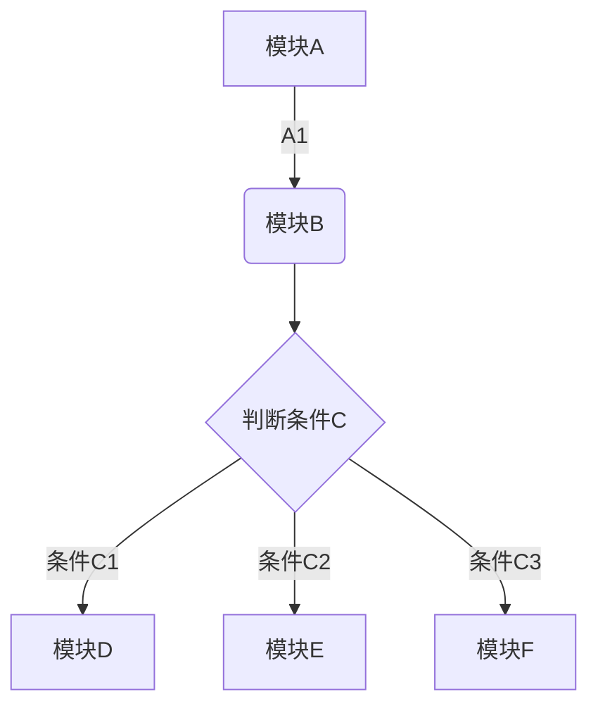
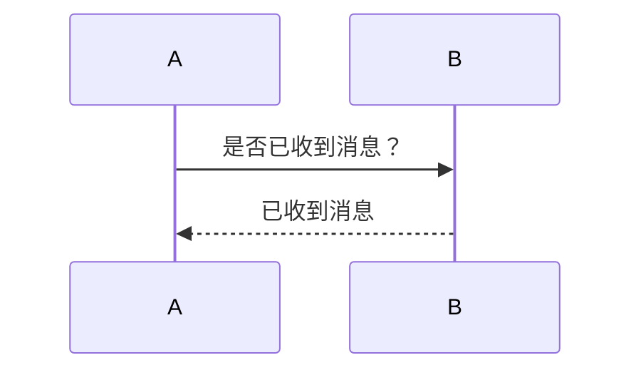
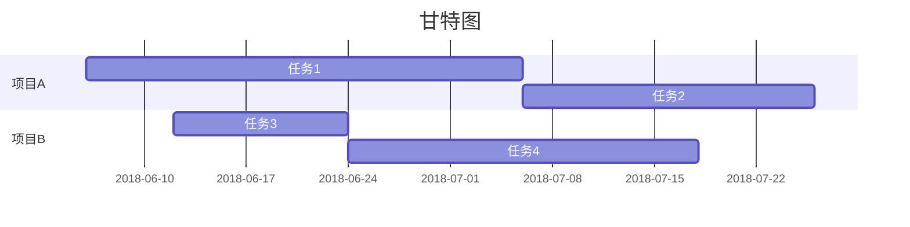

## 下划线

```html
<u>支持下滑线了</u>
```


## 添加待办事项

语法示例：

```md
三只青蛙
* [x] 第一只青蛙
* [ ] 第二只青蛙
* [ ] 第三只青蛙
```


## 插入表格

语法示例：

```md
| 帐户类型 | 免费帐户 | 标准帐户 | 高级帐户 |
| --- | --- | --- | --- |
| 帐户流量 | 60M | 1GB | 10GB |
| 设备数目 | 2台 | 无限制 | 无限制 |
| 当前价格 | 免费 | ￥8.17/月 | ￥12.33/月|
```


## 插入图表

目前支持饼状图、折线图、柱状图和条形图，只需将 type 改为对应的pie、line、column 和 bar。

```chart
,预算,收入,花费,债务
June,5000,8000,4000,6000
July,3000,1000,4000,3000
Aug,5000,7000,6000,3000
Sep,7000,2000,3000,1000
Oct,6000,5000,4000,2000
Nov,4000,3000,5000,

type: pie
title: 每月收益
x.title: Amount
y.title: Month
y.suffix: $
```


## 插入行内代码或代码块

印象笔记 Markdown 语法支持几十种编程语言的高亮的显示。（ [点击这里可以了解已经被高亮支持的语法](https://help.yinxiang.com/hc/articles/83623)）

语法示例：

```python
#!/usr/bin/python
import re

line = "Cats are smarter than dogs"

matchObj = re.match( r'(.*) are (.*?) .*', line, re.M|re.I)

if matchObj:
    print "matchObj.group() : ", matchObj.group()
    print "matchObj.group(1) : ", matchObj.group(1)
    print "matchObj.group(2) : ", matchObj.group(2)
else:
    print "No match!!"
```

## 插入数学公式

印象笔记 Markdown 支持绝大多数的 LaTeX 数学公式

语法示例：

```math
e^{i\pi} + 1 = 0
```

更多数学公式的输入可以参考：[https://khan.github.io/KaTeX/docs/supported.html](https://khan.github.io/KaTeX/docs/supported.html)


## 插入流程图

语法示例：




## 插入时序图

语法示例：




## 插入甘特图

语法示例：




## 设置目录

设置之后可以自动根据设置的分级标题来自动生成目录。

语法示例：

```md
[TOC]
```

## 参考

印象笔记 Markdown 入门指南
<https://list.yinxiang.com/markdown/eef42447-db3f-48ee-827b-1bb34c03eb83.php>
